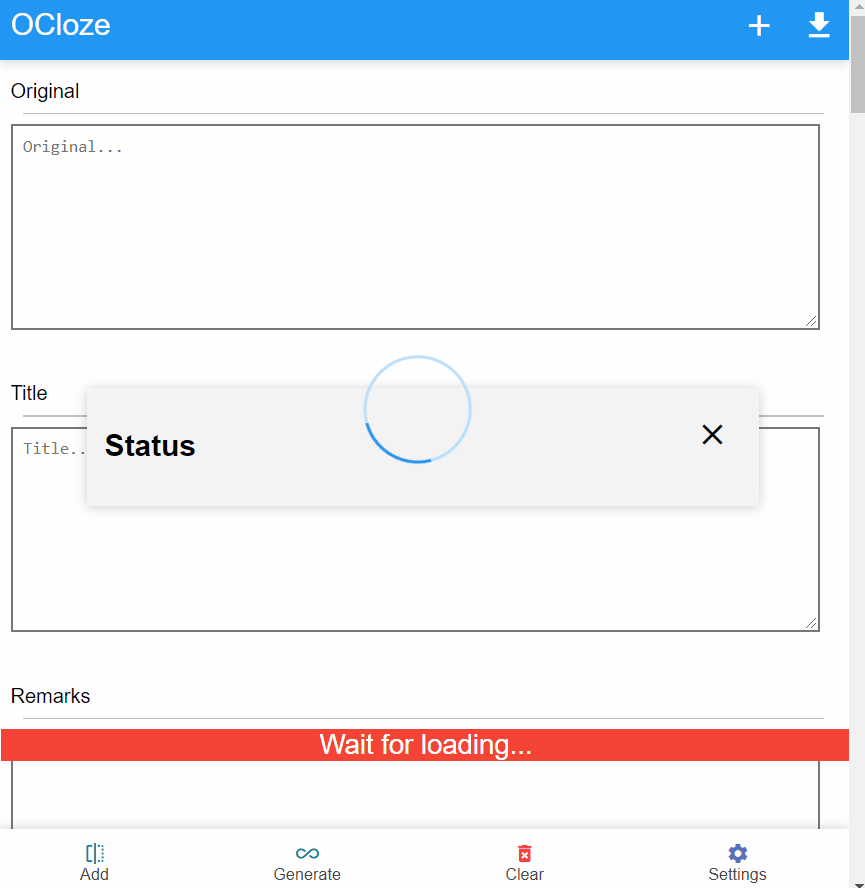

# ocloze
cloze overlapper in browser for Anki, AnkiMobile and AnkiDroid

The project made using HTML/CSS/JS, pyodide and genanki python module.

# Quick Start

Visit following in browser

https://infinyte7.github.io/ocloze/index.html

# Features
- Create cloze with text selection
- Auto generate cloze for list items
- Generate ready to import Anki Decks

# Demo
</img>

# Todo
- Implement settings for context before, after and prompts

# License
View [License.md](License.md)