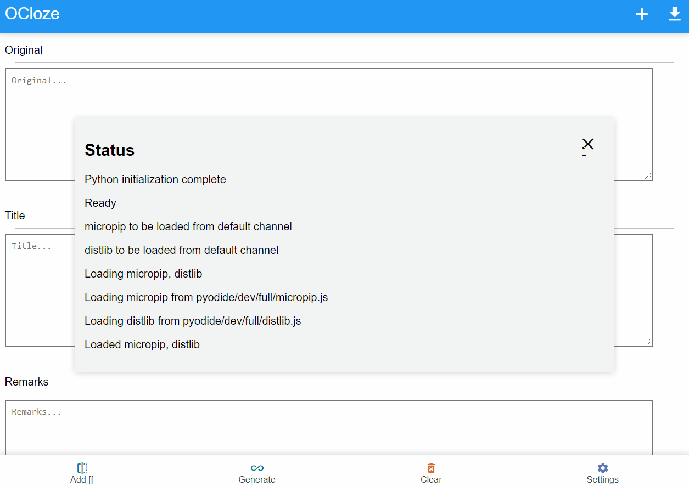
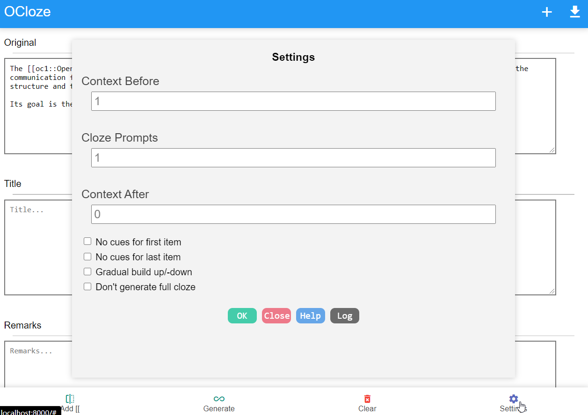

# ocloze
cloze overlapper in browser for Anki, AnkiMobile and AnkiDroid

The project made using HTML/CSS/JS, pyodide and genanki python module.

It is web app for original [cloze overlapper addon](https://github.com/glutanimate/cloze-overlapper).

# Quick Start

Visit following in browser

https://infinyte7.github.io/ocloze/index.html

# Features
- Create cloze with text selection
- Auto generate cloze for list items
- Generate ready to import Anki Decks
- Settings for context before, context after and cloze prompts

# How to create cloze?
## Create cloze in paragraph
1. Paste paragraph in ```Original``` field
2. Select a text in paragraph
3. Click ```Add [[``` button to create cloze for that text
4. Repeat 1-3 to add more cloze
5. Click ```Generate``` button to generate cloze
6. Click ```Add``` button to add generated cloze to list
7. Repeat to create more cloze
8. Finally, Click download button to export deck

## Auto generate cloze for list items
1. Paste list with item per line in ```Original``` field
2. Click ```Generate``` button to generate cloze
3. Click ```Add``` button to add generated cloze to list
4. Repeat 1-3 to create more cloze
5. Click download button to export deck

# Demo


# Available settings


# License
View [License.md](License.md)